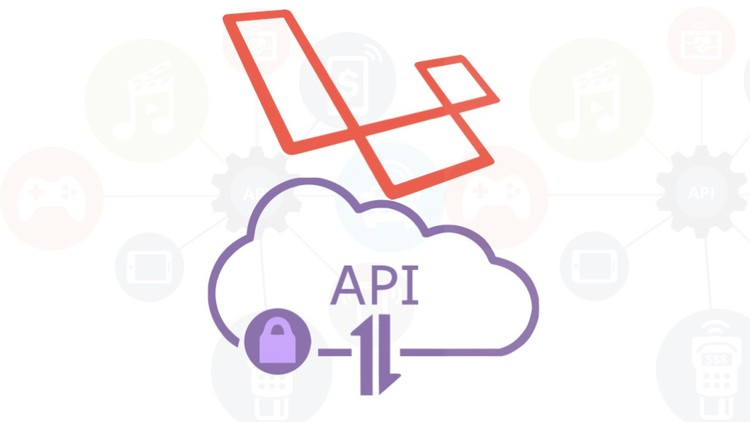

# API with Laravel

	

Tài liệu này là những kiến thức tổng hợp và cơ bản nhất về API, REST API và hướng dẫn để xây dựng một API trên nền tảng php với framework là laravel (phiên bản hiện đang sử dụng là laravel 5.7).

Tài liệu được xây dựng trong quá trình self training để có thể ghi lại những vấn đề cần chú ý dưới góc nhìn của một newbie, do đó không thể tránh khỏi thiếu sót.

Mọi đóng góp xin gửi về email: `phi.td@neo-lab.vn` .

## Các vấn đề sẽ được trình bày

* API
* REST API
* Xây dựng API với Laravel

## Tác giả

Trương Phi (@hiiamp)
